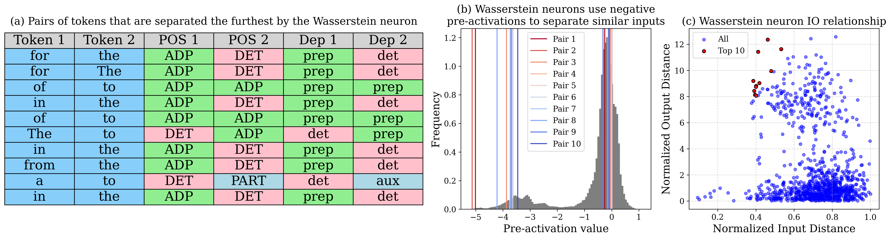

# [Negative Pre-activations Differentiate Syntax](https://openreview.net/forum?id=RzcCrU0tXP) - ICLR 2026
Here we include the code for our paper [Negative Pre-activations Differentiate Syntax](https://openreview.net/forum?id=RzcCrU0tXP).


*A Wasserstein neuron in Pythia 1.4B differentiating similar inputs to two distinct negative values.*

### Environment Setup
1. Create a conda environment:
   ```
   conda env create -f environment.yml
   ```
2. Install pip dependencies:
   ```
   conda activate negative-diff
   pip install -r requirements.txt
   ```